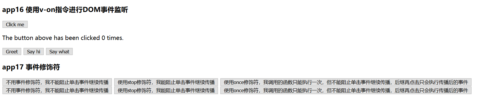
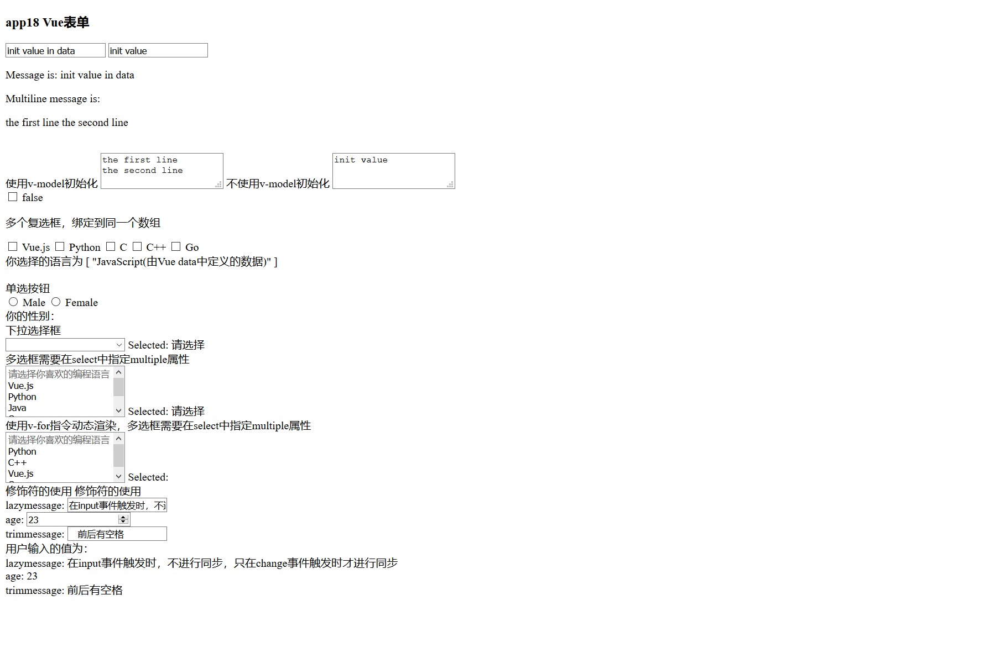
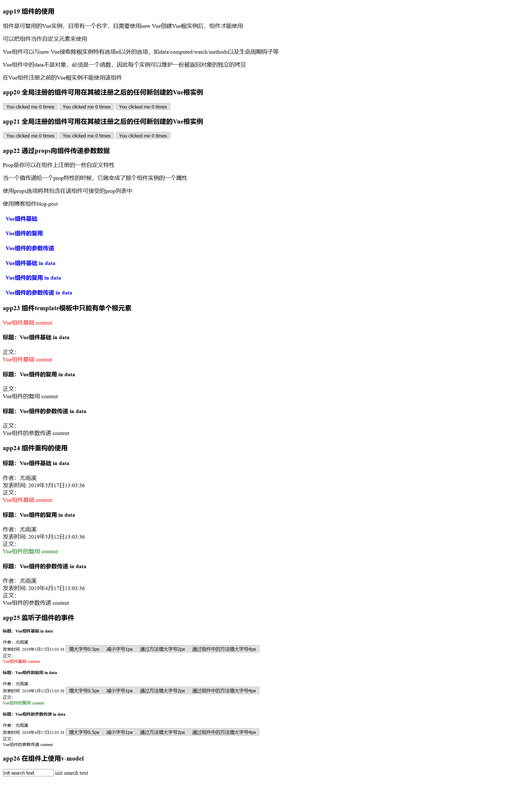
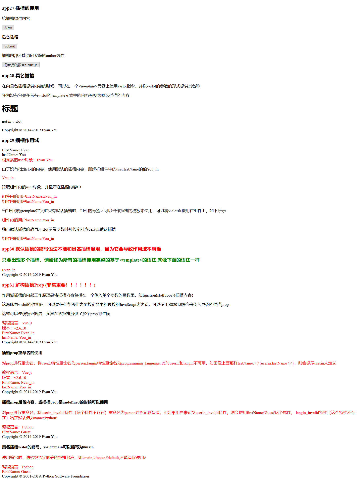
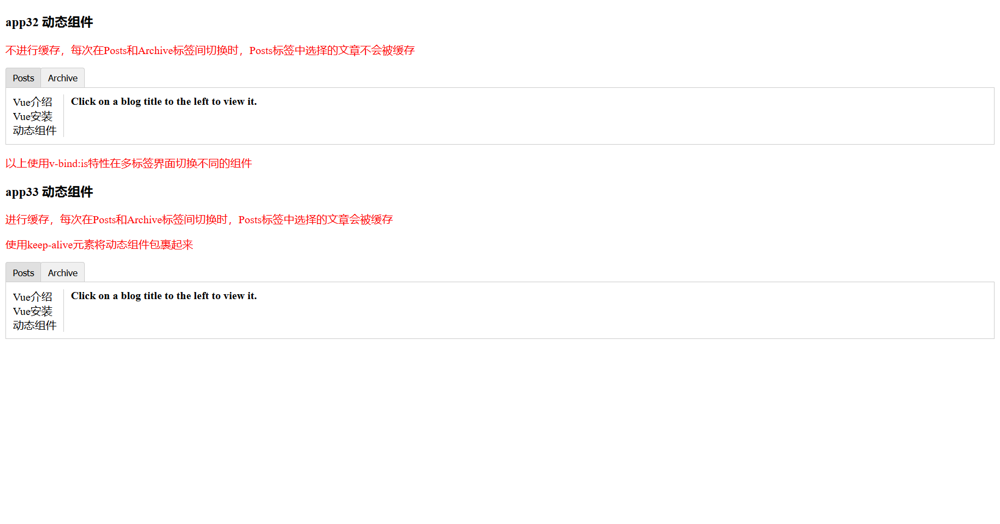

# hellovue
Recording the process of learning Vue.js

Check the HTML or VUE file for details.

Basic Example:

### app1-app15 基本使用: [hi.html](https://github.com/meizhaohui/hellovue/blob/master/src/hi.html "hi.html")

### app16-app17 事件处理:  [events.html](https://github.com/meizhaohui/hellovue/blob/master/src/events.html "events.html")

### app18 form表单:  [forms.html](https://github.com/meizhaohui/hellovue/blob/master/src/forms.html "forms.html")

### app19-app26 组件的使用:  [components.html](https://github.com/meizhaohui/hellovue/blob/master/src/components.html "components.html")

### app27-app31  插槽的使用:  [slot.html](https://github.com/meizhaohui/hellovue/blob/master/src/slot.html "slot.html")

### app32-app33  动态组件:  [components-dynamic.html](https://github.com/meizhaohui/hellovue/blob/master/src/components-dynamic.html "components-dynamic.html")

