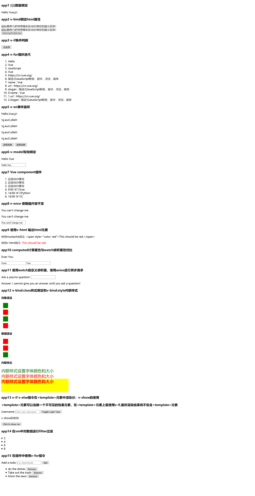

# hellovue
Recording the process of learning Vue.js

Check the HTML or VUE file for details.

Basic Example:

app1-app15: [hi.html](https://github.com/meizhaohui/hellovue/blob/master/src/hi.html "hi.html")

